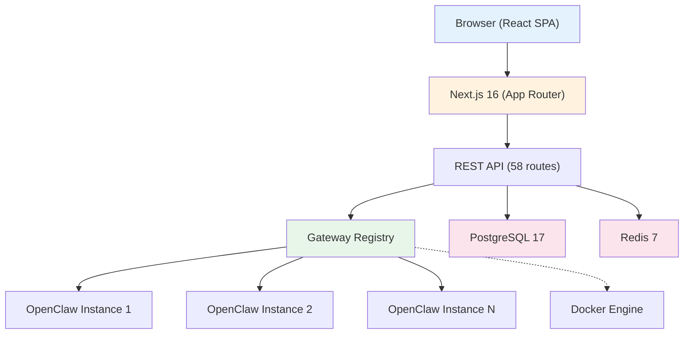
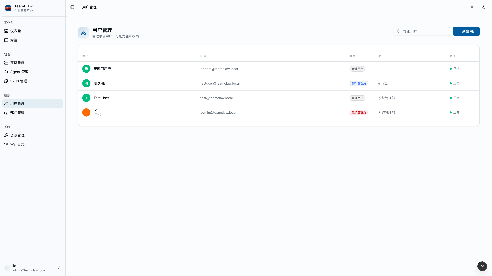
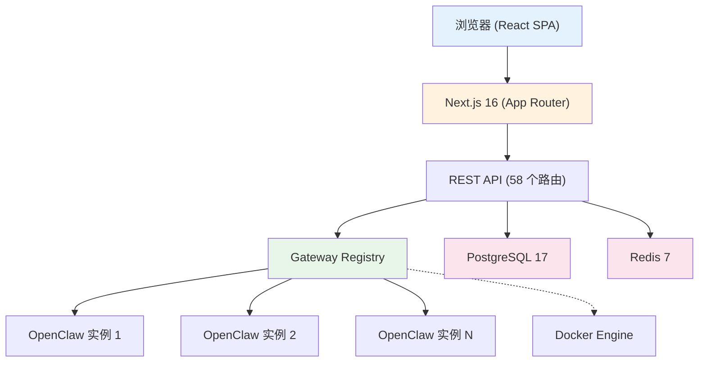

<p align="center">
  <h1 align="center">TeamClaw</h1>
  <p align="center">Enterprise OpenClaw AI Agent Management Platform</p>
  <p align="center">企业级 OpenClaw AI Agent 管理平台</p>
</p>

<p align="center">
  <a href="LICENSE"></a>
  <a href="https://nodejs.org/"></a>
  <a href="https://hub.docker.com/"></a>
</p>

<p align="center">
  <a href="#english">English</a> | <a href="#中文">中文</a>
</p>

---

<!-- Demo GIF -->
<p align="center">
  
</p>

---

<a id="english"></a>

## What is TeamClaw?

TeamClaw is a full-featured management platform built on top of [OpenClaw](https://github.com/anthropics/openclaw) — the open-source AI Agent gateway. It provides enterprise-grade capabilities that OpenClaw's native dashboard doesn't offer:

- **Multi-Instance Management** — Manage multiple OpenClaw instances from a single dashboard
- **RBAC Access Control** — Role-based permissions with department-level isolation
- **AI Chat Interface** — Chat with agents directly, with thinking process display and multi-conversation support
- **Agent Configuration** — Visual schema-driven config editor for all OpenClaw modules
- **Skills & Resources** — Manage agent skills and knowledge base resources
- **Model Provider Support** — Anthropic, OpenAI, MiniMax, Groq, and more
- **Full i18n** — English and Chinese interface with one-click switching
- **Docker Deployment** — One-command setup with Docker Compose

## Quick Start

### Option 1: Docker (Recommended)

```bash
git clone https://github.com/szsip239/teamclaw.git
cd teamclaw
bash setup.sh
```

This will:
1. Generate JWT keys and encryption secrets
2. Start PostgreSQL, Redis, and TeamClaw via Docker Compose
3. Initialize the database with default admin account

Visit `http://localhost:3000` — Login: `admin@teamclaw.local` / `Admin@123456`

### Option 2: Local Development

```bash
# 1. Clone and install
git clone https://github.com/szsip239/teamclaw.git
cd teamclaw
npm install

# 2. Start databases
docker compose up -d

# 3. Configure environment
cp .env.example .env
node scripts/generate-keys.mjs

# 4. Setup database
npx prisma generate
npx prisma db push
npx tsx prisma/seed.ts

# 5. Start dev server
npm run dev
```

## Architecture



### Tech Stack

| Layer | Technology |
|-------|-----------|
| Framework | Next.js 16 (App Router, Turbopack) |
| Frontend | React 19, Tailwind CSS 4, shadcn/ui |
| State | Zustand 5, TanStack Query v5 |
| Database | PostgreSQL 17 + Prisma 7 (Driver Adapter) |
| Cache | Redis 7 (ioredis) |
| Auth | RS256 JWT (jose) + bcryptjs |
| Gateway | WebSocket (ws) + Docker API (dockerode) |
| Validation | Zod 4 |

## Model Providers

TeamClaw supports any model provider compatible with OpenClaw:

| Provider | API Type | Configuration |
|----------|----------|---------------|
| Anthropic | `anthropic-messages` | Default provider |
| OpenAI | `openai` | Set `DEFAULT_MODEL_BASE_URL` |
| MiniMax | `openai` | Compatible API endpoint |
| Groq | `openai` | Compatible API endpoint |
| Local (Ollama) | `openai` | Point to local endpoint |

Configure via `.env` or per-instance in the dashboard.

## Screenshots

<table>
  <tr>
    <td align="center"><br><b>Dashboard</b></td>
    <td align="center"><br><b>AI Chat</b></td>
  </tr>
  <tr>
    <td align="center"><br><b>Agent Management</b></td>
    <td align="center"><br><b>Instance Management</b></td>
  </tr>
  <tr>
    <td align="center"><br><b>Config Editor</b></td>
    <td align="center"><br><b>User Management</b></td>
  </tr>
</table>

## Contributing

See [CONTRIBUTING.md](CONTRIBUTING.md) for development setup, coding standards, and PR guidelines.

## License

[MIT](LICENSE)

---

<a id="中文"></a>

## TeamClaw 是什么？

TeamClaw 是基于 [OpenClaw](https://github.com/anthropics/openclaw)（开源 AI Agent 网关）构建的全功能管理平台，提供 OpenClaw 原生面板不具备的企业级能力：

- **多实例管理** — 在统一面板管理多个 OpenClaw 实例
- **RBAC 权限控制** — 基于角色的权限体系，支持部门级隔离
- **AI 对话界面** — 直接与 Agent 对话，支持思考过程展示和多会话管理
- **Agent 配置** — 可视化 Schema 驱动的配置编辑器，覆盖所有 OpenClaw 模块
- **技能与资源** — 管理 Agent 技能和知识库资源
- **多模型支持** — Anthropic、OpenAI、MiniMax、Groq 等
- **完整国际化** — 中英文界面一键切换
- **Docker 部署** — 一条命令启动全栈服务

## 快速开始

### 方式一：Docker 部署（推荐）

```bash
git clone https://github.com/szsip239/teamclaw.git
cd teamclaw
bash setup.sh
```

脚本会自动：
1. 生成 JWT 密钥对和加密密钥
2. 通过 Docker Compose 启动 PostgreSQL、Redis 和 TeamClaw
3. 初始化数据库并创建默认管理员账号

访问 `http://localhost:3000` — 账号：`admin@teamclaw.local` / `Admin@123456`

### 方式二：本地开发

```bash
# 1. 克隆并安装依赖
git clone https://github.com/szsip239/teamclaw.git
cd teamclaw
npm install

# 2. 启动数据库服务
docker compose up -d

# 3. 配置环境变量
cp .env.example .env
node scripts/generate-keys.mjs

# 4. 初始化数据库
npx prisma generate
npx prisma db push
npx tsx prisma/seed.ts

# 5. 启动开发服务器
npm run dev
```

## 模型配置

| 提供商 | API 类型 | 说明 |
|--------|----------|------|
| Anthropic | `anthropic-messages` | 默认提供商 |
| OpenAI | `openai` | 设置 `DEFAULT_MODEL_BASE_URL` |
| MiniMax | `openai` | 兼容 OpenAI API |
| Groq | `openai` | 兼容 OpenAI API |
| 本地 (Ollama) | `openai` | 指向本地端点 |

通过 `.env` 文件或在面板中按实例配置。

## 系统架构



### 技术栈

| 层级 | 技术 |
|------|------|
| 框架 | Next.js 16 (App Router, Turbopack) |
| 前端 | React 19, Tailwind CSS 4, shadcn/ui |
| 状态管理 | Zustand 5, TanStack Query v5 |
| 数据库 | PostgreSQL 17 + Prisma 7 (Driver Adapter) |
| 缓存 | Redis 7 (ioredis) |
| 认证 | RS256 JWT (jose) + bcryptjs |
| 网关通信 | WebSocket (ws) + Docker API (dockerode) |
| 数据验证 | Zod 4 |

## 界面截图

<table>
  <tr>
    <td align="center"><br><b>仪表盘</b></td>
    <td align="center"><br><b>AI 对话</b></td>
  </tr>
  <tr>
    <td align="center"><br><b>Agent 管理</b></td>
    <td align="center"><br><b>实例管理</b></td>
  </tr>
  <tr>
    <td align="center"><br><b>配置编辑器</b></td>
    <td align="center"><br><b>用户管理</b></td>
  </tr>
</table>

## 贡献

详见 [CONTRIBUTING.md](CONTRIBUTING.md)，了解开发环境搭建、代码规范和 PR 流程。

## 许可证

[MIT](LICENSE)
