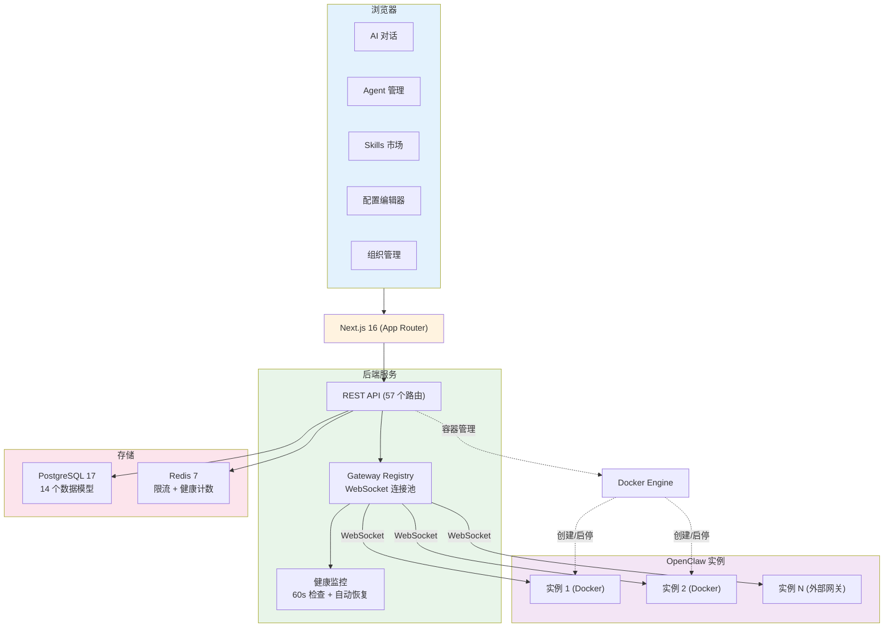
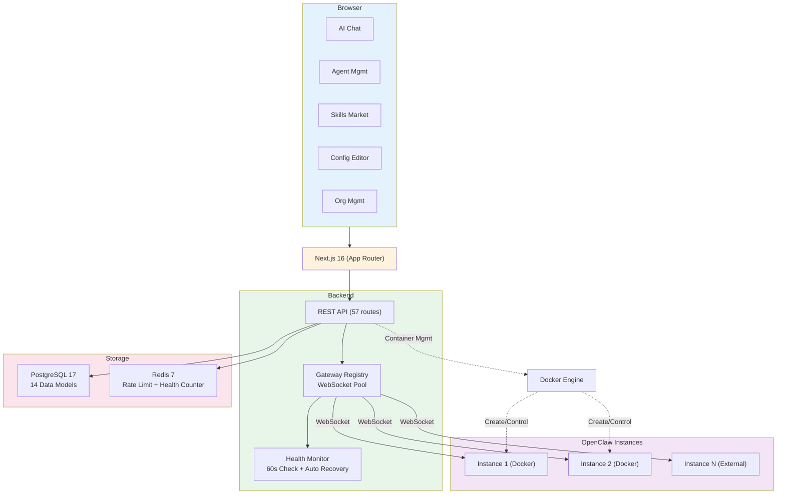

<p align="center">
  
</p>

<p align="center">
  <h1 align="center">TeamClaw</h1>
  <p align="center">Enterprise OpenClaw AI Agent Management Platform</p>
  <p align="center">企业级 OpenClaw AI Agent 管理平台</p>
</p>

<p align="center">
  <a href="LICENSE"></a>
  <a href="https://nodejs.org/"></a>
  <a href="https://github.com/szsip239/teamclaw/pkgs/container/teamclaw"></a>
</p>

<p align="center">
  <a href="#english">English</a> | <a href="#中文">中文</a>
</p>

---

<a id="中文"></a>

## TeamClaw 是什么？

TeamClaw 是基于 [OpenClaw](https://github.com/anthropics/openclaw)（🦞）构建的全功能管理平台，提供 OpenClaw 目前不具备的企业级能力。

### 核心功能

**AI 对话**
- 多会话管理 — 每个 Agent 支持创建多个独立对话
- 流式输出 — 逐 Token 实时显示回复内容
- 思考过程 — 可折叠展示 LLM 的推理链路
- 图片附件 — 支持发送图片（PNG/JPEG/GIF/WebP，最大 5MB）
- 上下文管理 — 对话历史快照与上下文重置

**Agent 管理**
- 跨实例 Agent 浏览与创建，支持克隆到不同实例
- 分类体系 — DEFAULT / DEPARTMENT / PERSONAL 三级分类
- 文件管理 — 树形浏览与在线编辑 Agent 配置文件
- 可视化配置编辑器 — Schema 驱动的表单，覆盖所有 OpenClaw 模块

**Skills 市场**
- ClawHub 集成 — 从公共市场搜索、安装和更新技能包
- 技能开发 — IDE 风格的文件编辑器，本地开发后发布到 ClawHub
- 版本管理 — 安装追踪、版本检查与一键升级
- 作用域控制 — 支持 PERSONAL / DEPARTMENT / GLOBAL 三级作用域

**多实例管理**
- Docker 一键创建 — 配置镜像、端口、绑定即可部署
- 外部网关接入 — 通过 URL + Token 连接已有 OpenClaw 实例
- 健康监控 — 60 秒周期检查，自动故障检测与实例恢复
- 生命周期管理 — 启动、停止、重启，实时日志查看

**组织与权限**
- RBAC 角色体系 — SYSTEM_ADMIN / DEPT_ADMIN / USER 三级权限
- 部门隔离 — 按部门分配实例和 Agent 访问权限
- 审计日志 — 全量操作追踪，支持筛选与 CSV 导出

**平台能力**
- 完整国际化 — 中英文界面一键切换
- 多模型支持 — Anthropic、OpenAI、MiniMax、Groq 等
- Docker 部署 — 一条命令启动全栈服务

## 快速开始

### 方式一：Docker 镜像拉取（最快）

```bash
docker pull ghcr.io/szsip239/teamclaw:latest
```

拉取指定版本：

```bash
docker pull ghcr.io/szsip239/teamclaw:0.1.1
```

> 镜像支持 `linux/amd64` 和 `linux/arm64` 架构。完整版本列表见 [GitHub Packages](https://github.com/szsip239/teamclaw/pkgs/container/teamclaw)。

### 方式二：Docker Compose 部署（推荐）

```bash
git clone https://github.com/szsip239/teamclaw.git
cd teamclaw
bash setup.sh
```

脚本会自动：
1. 生成 JWT 密钥对和加密密钥
2. 询问是否启用 Nginx HTTPS 反向代理（可选）
3. 通过 Docker Compose 启动 PostgreSQL、Redis 和 TeamClaw
4. 初始化数据库并创建默认管理员账号

访问 `http://localhost:3100` — 账号：`admin@teamclaw.local` / `Admin@123456`

#### 启用 HTTPS（可选）

`setup.sh` 会交互式询问是否启用 Nginx 反向代理。你也可以手动配置：

1. 将 SSL 证书文件放入 `nginx/cert/` 目录
2. 编辑 `.env` 设置 Nginx 变量：
   ```
   NGINX_SERVER_NAME="your-domain.com"
   NGINX_SSL_CERT="your-cert.crt"
   NGINX_SSL_KEY="your-cert.key"
   ```
3. 使用 `--profile nginx` 启动：
   ```bash
   docker compose -f docker-compose.prod.yml --profile nginx up -d
   ```

访问 `https://your-domain.com`

### 方式三：本地开发

```bash
# 1. 克隆并安装依赖
git clone https://github.com/anthropics/teamclaw.git
cd teamclaw
npm install

# 2. 启动数据库服务
docker compose up -d

# 3. 配置环境变量
cp .env.example .env
node scripts/generate-keys.mjs

# 4. 初始化数据库
npx prisma generate
npx prisma db push
npx tsx prisma/seed.ts

# 5. 启动开发服务器
npm run dev
```

## 首次使用指南

部署完成后，按以下步骤开始你的第一次 AI 对话：

### 1. 登录管理面板

访问 `http://localhost:3100`，使用默认管理员账号登录：

- 邮箱：`admin@teamclaw.local`
- 密码：`Admin@123456`

> 建议首次登录后立即修改默认密码。

### 2. 配置模型 API 密钥

进入 **资源管理** 页面，创建模型资源：

| 提供商 | API 协议 | 说明 |
|--------|----------|------|
| Anthropic | `anthropic-messages` | Claude 系列，默认提供商 |
| OpenAI | `openai-completions` | GPT / o 系列 |
| Google | `google-generative-ai` | Gemini 系列 |
| DeepSeek | `openai-completions` | DeepSeek V3 / R1 |
| MiniMax | `anthropic-messages` | Anthropic 兼容协议 |
| Groq / xAI / Mistral | `openai-completions` | OpenAI 兼容协议 |
| Ollama / vLLM | `ollama` / `openai-completions` | 本地部署 |

> 完整支持 20+ 提供商（智谱、豆包、千帆、Moonshot 等），详见资源管理页面。

点击 **创建资源** → 选择提供商 → 填入 API Key → 保存。可勾选"设为默认"供所有实例使用。

### 3. 部署 OpenClaw 实例

进入 **实例管理** 页面，选择以下任一方式：

**Docker 容器（推荐）** — 点击"创建实例"，选择 Docker 模式，填写实例名称，选择镜像（默认 `alpine/openclaw:latest`），点击创建即可自动部署。

**外部网关** — 如果已有运行中的 OpenClaw，选择外部网关模式，填入 WebSocket URL 和 Token 即可连接。

等待实例状态变为 🟢 **ONLINE**（通常 5-10 秒）。

### 4. 开始对话

进入 **AI 对话** 页面 — 实例上线后，默认 Agent 会自动出现在左侧栏。点击 Agent 即可开始对话。

```
✅ 登录 → 配置 API Key → 创建实例 → 开始对话（约 3 分钟）
```

## 系统架构


```mermaid
graph TB
    subgraph Client["浏览器"]
        Chat["AI 对话"]
        AgentUI["Agent 管理"]
        SkillUI["Skills 市场"]
        ConfigUI["配置编辑器"]
        OrgUI["组织管理"]
    end

    NextJS["Next.js 16 (App Router)"]

    subgraph Backend["后端服务"]
        API["REST API (57 个路由)"]
        GW["Gateway Registry<br/>WebSocket 连接池"]
        Health["健康监控<br/>60s 检查 + 自动恢复"]
    end

    subgraph Storage["存储"]
        PG["PostgreSQL 17<br/>14 个数据模型"]
        RD["Redis 7<br/>限流 + 健康计数"]
    end

    subgraph Instances["OpenClaw 实例"]
        OC1["实例 1 (Docker)"]
        OC2["实例 2 (Docker)"]
        OCN["实例 N (外部网关)"]
    end

    DK["Docker Engine"]

    Client --> NextJS
    NextJS --> API
    API --> GW
    API --> PG
    API --> RD
    GW --> Health
    GW -- "WebSocket" --> OC1
    GW -- "WebSocket" --> OC2
    GW -- "WebSocket" --> OCN
    API -. "容器管理" .-> DK
    DK -. "创建/启停" .-> OC1
    DK -. "创建/启停" .-> OC2

    style Client fill:#e3f2fd
    style NextJS fill:#fff3e0
    style Backend fill:#e8f5e9
    style Storage fill:#fce4ec
    style Instances fill:#f3e5f5
```

### 技术栈

| 层级 | 技术 |
|------|------|
| 框架 | Next.js 16 (App Router, Turbopack) |
| 前端 | React 19, Tailwind CSS 4, shadcn/ui |
| 状态管理 | Zustand 5, TanStack Query v5 |
| 数据库 | PostgreSQL 17 + Prisma 7 (Driver Adapter) |
| 缓存 | Redis 7 (ioredis) |
| 认证 | RS256 JWT (jose) + bcryptjs |
| 网关通信 | WebSocket (ws) + Docker API (dockerode) |
| 数据验证 | Zod 4 |

### 功能概览

| 模块 | 路由数 | 核心能力 |
|------|--------|---------|
| 对话 | 8 | 多会话、流式输出、思考展示、图片附件 |
| Agent | 6 | CRUD、克隆、分类、文件管理 |
| Skills | 12 | ClawHub 市场、安装/发布、版本管理、IDE 编辑 |
| 实例 | 13 | Docker 创建、外部接入、健康监控、配置编辑 |
| 认证 | 5 | JWT 登录、Token 轮转、限流 |
| 组织 | 5 | 用户/部门 CRUD、RBAC 权限 |
| 审计 | 2 | 操作日志、CSV 导出 |
| 仪表盘 | 1 | 实例/会话/用户/技能统计 |
| 其他 | 5 | 资源密钥、实例访问 |

## 界面截图

<table>
  <tr>
    <td align="center"><br><b>仪表盘</b></td>
    <td align="center"><br><b>AI 对话</b></td>
  </tr>
  <tr>
    <td align="center"><br><b>Agent 管理</b></td>
    <td align="center"><br><b>Skills 管理</b></td>
  </tr>
  <tr>
    <td align="center"><br><b>实例管理</b></td>
    <td align="center"><br><b>配置编辑器</b></td>
  </tr>
</table>

## 贡献

详见 [CONTRIBUTING.md](CONTRIBUTING.md)，了解开发环境搭建、代码规范和 PR 流程。

## 许可证

[MIT](LICENSE)

---

<a id="english"></a>

## What is TeamClaw?

TeamClaw is a full-featured management platform built on top of [OpenClaw](https://github.com/anthropics/openclaw) — 🦞the open-source AI Agent gateway🦞. It provides enterprise-grade capabilities that OpenClaw's native dashboard doesn't offer.

### Core Features

**AI Chat**
- Multi-conversation — create multiple independent sessions per agent
- Streaming responses — real-time token-by-token display
- Thinking process — collapsible LLM reasoning chain display
- Image attachments — send images with messages (PNG/JPEG/GIF/WebP, max 5MB)
- Context management — conversation snapshots and context reset

**Agent Management**
- Cross-instance agent browsing and creation, with cloning to other instances
- Classification — DEFAULT / DEPARTMENT / PERSONAL categories
- File management — tree view with online editing of agent config files
- Visual config editor — schema-driven forms covering all OpenClaw modules

**Skills Marketplace**
- ClawHub integration — search, install, and update skill packages from public marketplace
- Skill development — IDE-style file editor, develop locally and publish to ClawHub
- Version management — installation tracking, version checks, and one-click upgrades
- Scope control — PERSONAL / DEPARTMENT / GLOBAL skill scopes

**Multi-Instance Management**
- One-click Docker creation — configure image, ports, bind settings and deploy
- External gateway — connect existing OpenClaw instances via URL + token
- Health monitoring — 60-second periodic checks with automatic fault detection and recovery
- Lifecycle control — start, stop, restart, with real-time log streaming

**Organization & Permissions**
- RBAC — SYSTEM_ADMIN / DEPT_ADMIN / USER three-tier roles
- Department isolation — assign instance and agent access per department
- Audit logs — comprehensive operation tracking with filtering and CSV export

**Platform**
- Full i18n — English and Chinese interface with one-click switching
- Multi-model support — Anthropic, OpenAI, MiniMax, Groq, and more
- Docker deployment — one-command full-stack setup

## Quick Start

### Option 1: Docker Image Pull (Fastest)

```bash
docker pull ghcr.io/szsip239/teamclaw:latest
```

Pull a specific version:

```bash
docker pull ghcr.io/szsip239/teamclaw:0.1.1
```

> Supports `linux/amd64` and `linux/arm64`. See all versions at [GitHub Packages](https://github.com/szsip239/teamclaw/pkgs/container/teamclaw).

### Option 2: Docker Compose (Recommended)

```bash
git clone https://github.com/szsip239/teamclaw.git
cd teamclaw
bash setup.sh
```

This will:
1. Generate JWT keys and encryption secrets
2. Ask whether to enable Nginx HTTPS reverse proxy (optional)
3. Start PostgreSQL, Redis, and TeamClaw via Docker Compose
4. Initialize the database with default admin account

Visit `http://localhost:3100` — Login: `admin@teamclaw.local` / `Admin@123456`

#### Enable HTTPS (Optional)

`setup.sh` interactively asks whether to enable Nginx reverse proxy. You can also configure it manually:

1. Place SSL certificate files in `nginx/cert/`
2. Edit `.env` to set Nginx variables:
   ```
   NGINX_SERVER_NAME="your-domain.com"
   NGINX_SSL_CERT="your-cert.crt"
   NGINX_SSL_KEY="your-cert.key"
   ```
3. Start with `--profile nginx`:
   ```bash
   docker compose -f docker-compose.prod.yml --profile nginx up -d
   ```

Visit `https://your-domain.com`

### Option 3: Local Development

```bash
# 1. Clone and install
git clone https://github.com/anthropics/teamclaw.git
cd teamclaw
npm install

# 2. Start databases
docker compose up -d

# 3. Configure environment
cp .env.example .env
node scripts/generate-keys.mjs

# 4. Setup database
npx prisma generate
npx prisma db push
npx tsx prisma/seed.ts

# 5. Start dev server
npm run dev
```

## Architecture


```mermaid
graph TB
    subgraph Client["Browser"]
        Chat["AI Chat"]
        AgentUI["Agent Mgmt"]
        SkillUI["Skills Market"]
        ConfigUI["Config Editor"]
        OrgUI["Org Mgmt"]
    end

    NextJS["Next.js 16 (App Router)"]

    subgraph Backend["Backend"]
        API["REST API (57 routes)"]
        GW["Gateway Registry<br/>WebSocket Pool"]
        Health["Health Monitor<br/>60s Check + Auto Recovery"]
    end

    subgraph Storage["Storage"]
        PG["PostgreSQL 17<br/>14 Data Models"]
        RD["Redis 7<br/>Rate Limit + Health Counter"]
    end

    subgraph Instances["OpenClaw Instances"]
        OC1["Instance 1 (Docker)"]
        OC2["Instance 2 (Docker)"]
        OCN["Instance N (External)"]
    end

    DK["Docker Engine"]

    Client --> NextJS
    NextJS --> API
    API --> GW
    API --> PG
    API --> RD
    GW --> Health
    GW -- "WebSocket" --> OC1
    GW -- "WebSocket" --> OC2
    GW -- "WebSocket" --> OCN
    API -. "Container Mgmt" .-> DK
    DK -. "Create/Control" .-> OC1
    DK -. "Create/Control" .-> OC2

    style Client fill:#e3f2fd
    style NextJS fill:#fff3e0
    style Backend fill:#e8f5e9
    style Storage fill:#fce4ec
    style Instances fill:#f3e5f5
```

### Tech Stack

| Layer | Technology |
|-------|-----------|
| Framework | Next.js 16 (App Router, Turbopack) |
| Frontend | React 19, Tailwind CSS 4, shadcn/ui |
| State | Zustand 5, TanStack Query v5 |
| Database | PostgreSQL 17 + Prisma 7 (Driver Adapter) |
| Cache | Redis 7 (ioredis) |
| Auth | RS256 JWT (jose) + bcryptjs |
| Gateway | WebSocket (ws) + Docker API (dockerode) |
| Validation | Zod 4 |

### Feature Overview

| Module | Routes | Key Capabilities |
|--------|--------|-----------------|
| Chat | 8 | Multi-conversation, streaming, thinking display, image attachments |
| Agents | 6 | CRUD, clone, classify, file management |
| Skills | 12 | ClawHub marketplace, install/publish, version management, IDE editor |
| Instances | 13 | Docker create, external gateway, health monitoring, config editor |
| Auth | 5 | JWT login, token rotation, rate limiting |
| Org | 5 | User/department CRUD, RBAC |
| Audit | 2 | Operation logs, CSV export |
| Dashboard | 1 | Instance/session/user/skill metrics |
| Other | 5 | Resource keys, instance access |

## Getting Started Guide

After deployment, follow these steps to start your first AI conversation:

### 1. Login

Visit `http://localhost:3100` and sign in with the default admin account:

- Email: `admin@teamclaw.local`
- Password: `Admin@123456`

> Recommended: Change the default password after first login.

### 2. Configure Model API Key

Navigate to the **Resources** page to create a model resource:

| Provider | API Protocol | Notes |
|----------|-------------|-------|
| Anthropic | `anthropic-messages` | Claude models, default provider |
| OpenAI | `openai-completions` | GPT / o series |
| Google | `google-generative-ai` | Gemini series |
| DeepSeek | `openai-completions` | DeepSeek V3 / R1 |
| MiniMax | `anthropic-messages` | Anthropic-compatible protocol |
| Groq / xAI / Mistral | `openai-completions` | OpenAI-compatible protocol |
| Ollama / vLLM | `ollama` / `openai-completions` | Local deployment |

> 20+ providers supported (OpenRouter, Together, HuggingFace, etc.). See the Resources page for the full list.

Click **Create Resource** → Select provider → Enter API key → Save. Toggle "Set as default" to use this key for all instances.

### 3. Deploy an OpenClaw Instance

Navigate to the **Instances** page and choose one of:

**Docker Container (Recommended)** — Click "Create Instance", select Docker mode, enter a name, choose an image (default: `alpine/openclaw:latest`), and create. The container deploys automatically.

**External Gateway** — If you already have a running OpenClaw, select external gateway mode, enter the WebSocket URL and token to connect.

Wait for instance status to become 🟢 **ONLINE** (typically 5-10 seconds).

### 4. Start Chatting

Navigate to the **Chat** page — once the instance is online, default agents appear in the left sidebar. Click an agent to start your conversation.

```
✅ Login → Configure API Key → Create Instance → Start Chatting (~3 minutes)
```

## Screenshots

<table>
  <tr>
    <td align="center"><br><b>Dashboard</b></td>
    <td align="center"><br><b>AI Chat</b></td>
  </tr>
  <tr>
    <td align="center"><br><b>Agent Management</b></td>
    <td align="center"><br><b>Skills Marketplace</b></td>
  </tr>
  <tr>
    <td align="center"><br><b>Instance Management</b></td>
    <td align="center"><br><b>Config Editor</b></td>
  </tr>
</table>

## Contributing

See [CONTRIBUTING.md](CONTRIBUTING.md) for development setup, coding standards, and PR guidelines.

## License

[MIT](LICENSE)

---
