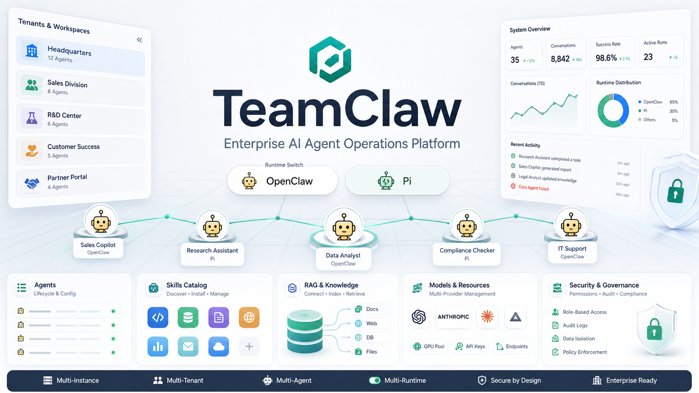
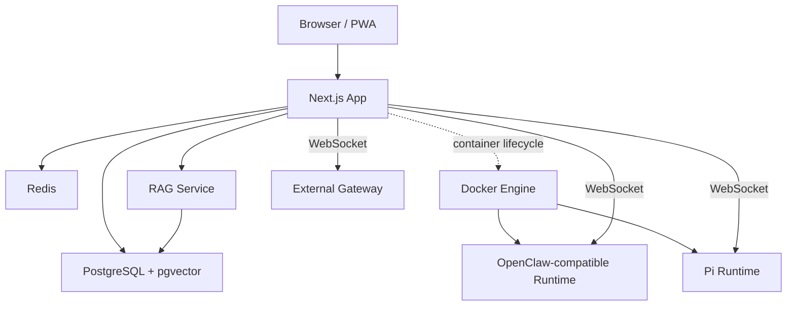
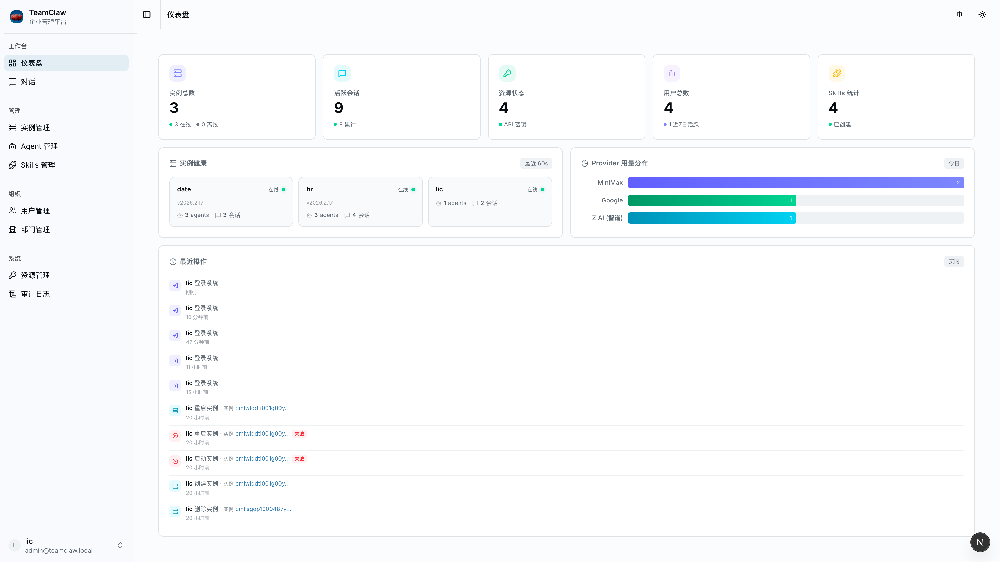
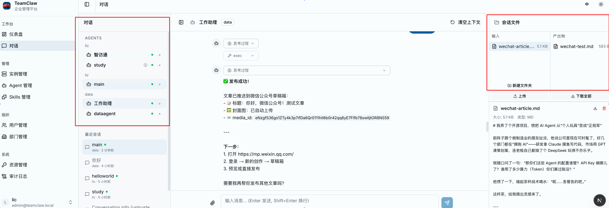
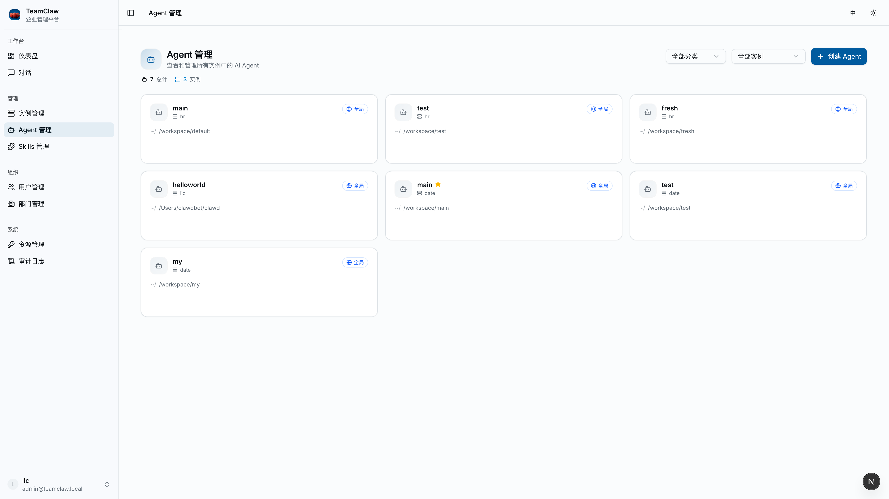
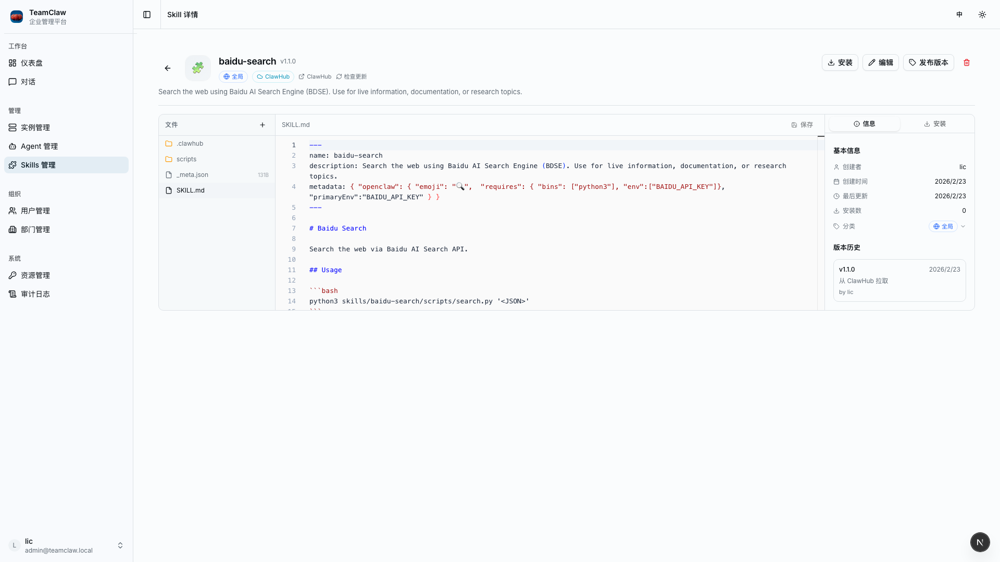
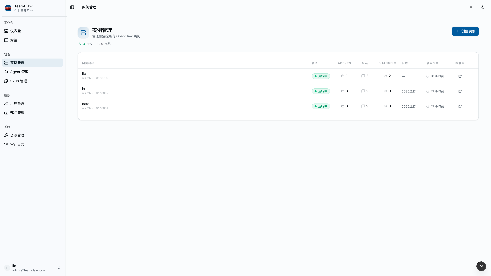
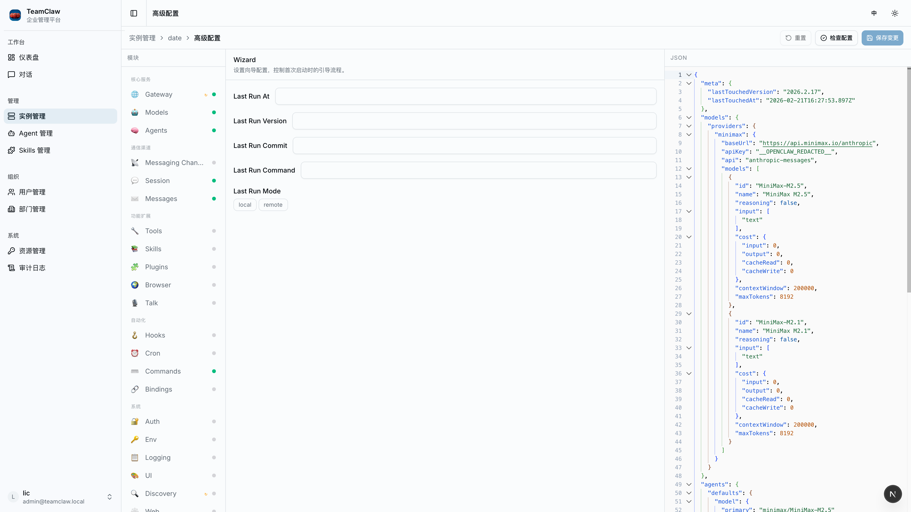

<p align="center">
  
</p>

<p align="center">
  <h1 align="center">TeamClaw</h1>
  <p align="center">Enterprise AI Agent Operations Platform</p>
  <p align="center">企业级多实例 · 多租户 · 多 Agent · 多 Runtime 管理平台</p>
</p>

<p align="center">
  <a href="LICENSE"></a>
  <a href="https://nodejs.org/"></a>
  <a href="https://github.com/szsip239/teamclaw/releases"></a>
</p>

<p align="center">
  <a href="#中文">中文</a> | <a href="#english">English</a>
</p>

---

<a id="中文"></a>

## TeamClaw 是什么？

TeamClaw 是面向企业内部 AI Agent 落地的 operations control plane。它把 runtime 实例、Agent、Skills、模型资源、知识库、权限、审计和对话体验收口到一个多租户平台里，让团队可以在同一套界面里管理多个实例、多个部门、多个 Agent 和多个 runtime。

[OpenClaw](https://github.com/anthropics/openclaw)、Pi 和后续 runtime 在 TeamClaw 中都是可插拔执行引擎。用户可以在 Chat 输入区切换普通/快速模式，平台层负责模型资源同步、会话隔离、文件产物、权限、审计和运维。

### v0.6.0 更新重点

- **多 Runtime Chat**：OpenClaw-compatible runtime 与 Pi runtime 在同一对话界面切换，支持 runtime 图标、当前模型展示和后台运行状态。
- **Pi Agent Runtime**：新增 Pi 会话、流式回复、图表/文件产物、模型配置同步和安全 gateway 接入。
- **OpenClaw 6.6 / v4 协议**：锁定 v4 gateway 协议，重构工具过程、阶段回复、隐藏 thinking 和错误结束状态。
- **文件产物稳定化**：生成文件归一化到 session output，重名自动编号，send/history/queue 共用下载链接补全与去重路径。
- **模型与资源同步**：支持 provider variants、OpenClaw/Pi 模型推送，并可在推送时选择 `low / medium / xhigh` 思考档位。
- **Agent 工作台体验**：Agent 长按重命名、运行中指示、未读/错误状态、后台对话完成提醒和最近会话排序修复。

### 核心能力

- 多实例和多租户：托管 Docker 实例、外部 gateway、部门隔离、RBAC、审计日志。
- 多 Agent 工作台：跨实例 Agent 浏览、创建、克隆、重命名、文件编辑和运行状态展示。
- Chat 体验：流式回复、工具过程、阶段回复、图片附件、文件下载、后台完成提醒。
- Skills 管理：ClawHub 搜索、安装、升级、本地编辑和实例自动发现。
- 模型资源：Provider variants、API Key 加密存储、默认模型、OpenClaw/Pi 同步推送。
- 知识库：PDF/DOCX/Excel 上传，Postgres FTS + pgvector + RRF 混合检索，PDF 页码预览。
- 工具箱：法规追踪、舆情监控等企业辅助工具入口。

## 快速开始

> TeamClaw 依赖 PostgreSQL、Redis、RAG service 和 Docker socket，**不支持**单独 `docker run` 启动。生产或试用请优先使用 `setup.sh`。

### 生产/试用部署

前置要求：

- Docker 与 Docker Compose v2
- `git`、`openssl`、`curl`
- Linux 上运行脚本的用户需要能访问 Docker daemon

```bash
git clone https://github.com/szsip239/teamclaw.git
cd teamclaw
bash setup.sh
```

`setup.sh` 会完成：

- 从 `.env.example` 创建 `.env`
- 只在空值或占位符时生成 JWT、加密密钥、数据库密码、RAG 内部密钥和初始管理员密码；复跑时保留已有值
- 自动设置 `TEAMCLAW_DATA_DIR`，Linux 下自动检测 `DOCKER_GID`
- 可选配置 Nginx HTTPS
- 启动 `docker-compose.prod.yml`，运行数据库迁移和 seed
- 检查 Web 服务是否可访问

访问 `http://localhost:3100`。初始管理员邮箱和密码会在 `setup.sh` 完成时打印，也会写入 `.env`：

- `INITIAL_ADMIN_EMAIL`
- `INITIAL_ADMIN_PASSWORD`

### 手动生产部署

仅当你不想使用交互式脚本时使用。请先准备好 `.env` 中的密钥、端口和数据目录：

```bash
cp .env.example .env
node scripts/generate-keys.mjs --write
# 编辑 .env：TEAMCLAW_DATA_DIR、可选 Nginx 证书配置

docker compose -f docker-compose.prod.yml up -d --build
docker compose -f docker-compose.prod.yml logs -f app
```

启用 Nginx HTTPS 时，把证书放到 `nginx/cert/`，设置 `.env` 中的 `NGINX_*`，再启动：

```bash
docker compose -f docker-compose.prod.yml --profile nginx up -d --build
```

如果目标主机已有其他反向代理占用 `80/443`，不要直接启用 TeamClaw 的 nginx profile。应改用现有反向代理转发到 TeamClaw app 端口，或设置不冲突的 `NGINX_HTTP_PORT` / `NGINX_HTTPS_PORT`。

### 本地开发

推荐用 Docker 起基础服务，Next.js 在宿主机开发：

```bash
git clone https://github.com/szsip239/teamclaw.git
cd teamclaw
cp .env.example .env
node scripts/generate-keys.mjs --write

docker compose up -d
npm install
npx prisma generate
npx prisma db push
npx tsx prisma/seed.ts
npm run dev
```

访问 `http://localhost:3100`。如果希望 app 也在 Docker 内运行：

```bash
docker compose --profile app up -d --build
```

### 首次使用流程

1. 进入 **资源管理**，创建模型资源并设置默认模型。
2. 进入 **实例管理**，创建 Docker 实例或接入外部 gateway。默认普通 runtime 镜像是 `alpine/openclaw:2026.6.6-browser`。
3. 实例上线后进入 **AI 对话**，选择 Agent 开始对话。
4. 需要知识库时，在 **知识库** 页面配置 RAG LLM、Embedding、Rerank 和 PaddleOCR。
5. 需要 Skills 时，在 **Skills 管理** 中搜索、安装或编辑。

### 用户必须关心的配置

| 配置                                                    | 说明                                                                            |
| ------------------------------------------------------- | ------------------------------------------------------------------------------- |
| `JWT_PRIVATE_KEY` / `JWT_PUBLIC_KEY` / `ENCRYPTION_KEY` | `setup.sh` 或 `node scripts/generate-keys.mjs --write` 生成；上线后不要随意轮换 |
| `POSTGRES_PASSWORD` / `RAG_SERVICE_SECRET`              | `setup.sh` 或 `node scripts/generate-keys.mjs --write` 生成；不要使用固定公开值 |
| `INITIAL_ADMIN_EMAIL` / `INITIAL_ADMIN_PASSWORD`        | 只在首次 seed 创建管理员时使用；已有管理员复跑时不会被重置                      |
| `TEAMCLAW_DATA_DIR`                                     | 托管 runtime 的宿主机数据目录，必须是绝对路径                                   |
| `DOCKER_SOCKET_PATH` / `DOCKER_GID`                     | TeamClaw 管理 Docker runtime 所需；`setup.sh` 会尽量自动检测                    |
| `DEFAULT_OPENCLAW_IMAGE`                                | 新建普通 runtime 的默认镜像，默认 `alpine/openclaw:2026.6.6-browser`            |

更细的 RAG 并发、OCR、Embedding 维度和模型预算参数请看 `.env.example`；多数用户应该优先在后台 UI 配置。

## 系统架构


```mermaid
graph TB
    Browser["Browser / PWA"]
    Next["Next.js App"]
    PG["PostgreSQL + pgvector"]
    Redis["Redis"]
    RAG["RAG Service"]
    Docker["Docker Engine"]
    OC["OpenClaw-compatible Runtime"]
    PI["Pi Runtime"]
    External["External Gateway"]

    Browser --> Next
    Next --> PG
    Next --> Redis
    Next --> RAG
    RAG --> PG
    Next -. container lifecycle .-> Docker
    Docker --> OC
    Docker --> PI
    Next -- WebSocket --> OC
    Next -- WebSocket --> PI
    Next -- WebSocket --> External
```

### 技术栈

| 层级       | 技术                                               |
| ---------- | -------------------------------------------------- |
| Web        | Next.js 16, React 19, Tailwind CSS 4, shadcn/ui    |
| 状态与数据 | Zustand, TanStack Query, Prisma                    |
| 存储       | PostgreSQL 17 + pgvector, Redis 7                  |
| RAG        | Python FastAPI, asyncpg, tsvector, pgvector, jieba |
| 通信       | WebSocket gateway, Pi wrapper, Docker API          |
| 安全       | RS256 JWT, bcryptjs, 加密存储资源密钥              |

## 界面截图

<table>
  <tr>
    <td align="center"><br><b>仪表盘</b></td>
    <td align="center"><br><b>AI 对话</b></td>
  </tr>
  <tr>
    <td align="center"><br><b>Agent 管理</b></td>
    <td align="center"><br><b>Skills 管理</b></td>
  </tr>
  <tr>
    <td align="center"><br><b>实例管理</b></td>
    <td align="center"><br><b>配置编辑器</b></td>
  </tr>
</table>

## 贡献

详见 [CONTRIBUTING.md](CONTRIBUTING.md)，了解开发环境搭建、代码规范和 PR 流程。

## 许可证

[MIT](LICENSE)

---

<a id="english"></a>

## What is TeamClaw?

TeamClaw is an enterprise operations control plane for internal AI Agent deployments. It brings runtime instances, agents, skills, model resources, knowledge bases, permissions, audit logs, and chat workflows into one multi-tenant platform.

[OpenClaw](https://github.com/anthropics/openclaw), Pi, and future engines are pluggable runtimes in TeamClaw. Users can switch between normal and fast runtime modes in the chat composer, while the platform manages model sync, sessions, artifacts, permissions, audit logs, and operations.

### v0.6.0 Highlights

- **Multi-runtime Chat**: OpenClaw-compatible and Pi runtimes share one chat surface with runtime icons, model display, and background status.
- **Pi Agent Runtime**: Added Pi sessions, streaming replies, charts/file artifacts, model config sync, and secured gateway access.
- **OpenClaw 6.6 / v4 protocol**: Locked to gateway protocol v4 and refactored tool progress, staged replies, hidden thinking, and error completion states.
- **Reliable artifacts**: Generated files are normalized into session output, duplicate filenames are auto-numbered, and send/history/queue share download-link finalization.
- **Model and resource sync**: Provider variants, OpenClaw/Pi model push, and selectable `low / medium / xhigh` thinking levels.
- **Agent workspace UX**: Long-press rename, running indicators, unread/error badges, background completion notices, and recent-session ordering fixes.

### Core Capabilities

- Multi-instance and multi-tenant operations: managed Docker instances, external gateways, RBAC, department isolation, audit logs.
- Multi-agent workspace: browse, create, clone, rename, edit files, and monitor runtime status across instances.
- Chat workflow: streaming replies, tool progress, staged replies, image attachments, file downloads, background completion reminders.
- Skills management: ClawHub search/install/update, local editing, and automatic instance discovery.
- Model resources: provider variants, encrypted API keys, default models, OpenClaw/Pi model push.
- Knowledge base: PDF/DOCX/Excel upload, Postgres FTS + pgvector + RRF hybrid retrieval, PDF page preview.
- Toolbox: enterprise utilities such as regulation tracking and public-opinion monitoring.

## Quick Start

> TeamClaw requires PostgreSQL, Redis, the RAG service, and Docker socket access. Standalone `docker run` is **not** supported. Use `setup.sh` for production or trial deployments.

### Production / Trial Deployment

Requirements:

- Docker and Docker Compose v2
- `git`, `openssl`, `curl`
- On Linux, the current user must be able to access the Docker daemon

```bash
git clone https://github.com/szsip239/teamclaw.git
cd teamclaw
bash setup.sh
```

`setup.sh` will:

- Create `.env` from `.env.example`
- Generate JWT/encryption secrets, database password, RAG internal secret, and initial admin password only when values are missing or placeholders; reruns preserve existing values
- Set `TEAMCLAW_DATA_DIR` and auto-detect `DOCKER_GID` on Linux
- Optionally configure Nginx HTTPS
- Start `docker-compose.prod.yml`, run DB migrations, and seed the admin user
- Verify that the web app responds

Open `http://localhost:3100`. The initial admin email and password are printed by `setup.sh` and written to `.env`:

- `INITIAL_ADMIN_EMAIL`
- `INITIAL_ADMIN_PASSWORD`

### Manual Production Deployment

Use this only if you do not want the interactive setup script:

```bash
cp .env.example .env
node scripts/generate-keys.mjs --write
# Edit .env: TEAMCLAW_DATA_DIR, optional Nginx settings

docker compose -f docker-compose.prod.yml up -d --build
docker compose -f docker-compose.prod.yml logs -f app
```

For Nginx HTTPS, place certificates under `nginx/cert/`, configure `NGINX_*` in `.env`, then run:

```bash
docker compose -f docker-compose.prod.yml --profile nginx up -d --build
```

If another reverse proxy already owns `80/443` on the target host, do not enable TeamClaw's nginx profile with default ports. Route the existing proxy to the TeamClaw app port, or set non-conflicting `NGINX_HTTP_PORT` / `NGINX_HTTPS_PORT`.

### Local Development

Recommended mode: Docker for infrastructure, host process for Next.js:

```bash
git clone https://github.com/szsip239/teamclaw.git
cd teamclaw
cp .env.example .env
node scripts/generate-keys.mjs --write

docker compose up -d
npm install
npx prisma generate
npx prisma db push
npx tsx prisma/seed.ts
npm run dev
```

Open `http://localhost:3100`. To run the app container too:

```bash
docker compose --profile app up -d --build
```

### First-Use Checklist

1. Open **Resources**, create a model resource, and mark a default model.
2. Open **Instances**, create a Docker instance or connect an external gateway. The default normal runtime image is `alpine/openclaw:2026.6.6-browser`.
3. Open **AI Chat**, select an agent, and start a conversation.
4. Configure RAG LLM, Embedding, Rerank, and PaddleOCR in **Knowledge Bases** when needed.
5. Install or edit skills from **Skills** when needed.

### Configuration You Actually Need

| Config                                                  | Notes                                                                                                        |
| ------------------------------------------------------- | ------------------------------------------------------------------------------------------------------------ |
| `JWT_PRIVATE_KEY` / `JWT_PUBLIC_KEY` / `ENCRYPTION_KEY` | Generated by `setup.sh` or `node scripts/generate-keys.mjs --write`; do not rotate casually after deployment |
| `POSTGRES_PASSWORD` / `RAG_SERVICE_SECRET`              | Generated by `setup.sh` or `node scripts/generate-keys.mjs --write`; do not use fixed public values          |
| `INITIAL_ADMIN_EMAIL` / `INITIAL_ADMIN_PASSWORD`        | Used only when seed creates the first admin user; reruns preserve an existing admin password                 |
| `TEAMCLAW_DATA_DIR`                                     | Absolute host path for managed runtime data                                                                  |
| `DOCKER_SOCKET_PATH` / `DOCKER_GID`                     | Required for TeamClaw to manage Docker runtimes; `setup.sh` auto-detects where possible                      |
| `DEFAULT_OPENCLAW_IMAGE`                                | Default normal runtime image, `alpine/openclaw:2026.6.6-browser`                                             |

Detailed RAG concurrency, OCR, embedding dimension, and model-budget variables live in `.env.example`. Most users should configure RAG from the admin UI first.

## Architecture


```mermaid
graph TB
    Browser["Browser / PWA"]
    Next["Next.js App"]
    PG["PostgreSQL + pgvector"]
    Redis["Redis"]
    RAG["RAG Service"]
    Docker["Docker Engine"]
    OC["OpenClaw-compatible Runtime"]
    PI["Pi Runtime"]
    External["External Gateway"]

    Browser --> Next
    Next --> PG
    Next --> Redis
    Next --> RAG
    RAG --> PG
    Next -. container lifecycle .-> Docker
    Docker --> OC
    Docker --> PI
    Next -- WebSocket --> OC
    Next -- WebSocket --> PI
    Next -- WebSocket --> External
```

### Tech Stack

| Layer          | Technology                                          |
| -------------- | --------------------------------------------------- |
| Web            | Next.js 16, React 19, Tailwind CSS 4, shadcn/ui     |
| State and data | Zustand, TanStack Query, Prisma                     |
| Storage        | PostgreSQL 17 + pgvector, Redis 7                   |
| RAG            | Python FastAPI, asyncpg, tsvector, pgvector, jieba  |
| Communication  | WebSocket gateway, Pi wrapper, Docker API           |
| Security       | RS256 JWT, bcryptjs, encrypted provider credentials |

## Screenshots

<table>
  <tr>
    <td align="center"><br><b>Dashboard</b></td>
    <td align="center"><br><b>AI Chat</b></td>
  </tr>
  <tr>
    <td align="center"><br><b>Agent Management</b></td>
    <td align="center"><br><b>Skills</b></td>
  </tr>
  <tr>
    <td align="center"><br><b>Instance Management</b></td>
    <td align="center"><br><b>Config Editor</b></td>
  </tr>
</table>

## Contributing

See [CONTRIBUTING.md](CONTRIBUTING.md) for development setup, coding standards, and PR guidelines.

## License

[MIT](LICENSE)
