<p align="center">
  <h1 align="center">TeamClaw</h1>
  <p align="center">Enterprise OpenClaw AI Agent Management Platform</p>
  <p align="center">企业级 OpenClaw AI Agent 管理平台</p>
</p>

<p align="center">
  <a href="LICENSE"></a>
  <a href="https://nodejs.org/"></a>
  <a href="https://github.com/szsip239/teamclaw/pkgs/container/teamclaw"></a>
</p>

<p align="center">
  <a href="#english">English</a> | <a href="#中文">中文</a>
</p>

---

<!-- Demo GIF -->
<p align="center">
  
</p>

---

<a id="中文"></a>

## TeamClaw 是什么？

TeamClaw 是基于 [OpenClaw](https://github.com/anthropics/openclaw)（🦞）构建的全功能管理平台，提供 OpenClaw 目前不具备的企业级能力。

### 核心功能

**AI 对话**
- 多会话管理 — 每个 Agent 支持创建多个独立对话
- 流式输出 — 逐 Token 实时显示回复内容
- 思考过程 — 可折叠展示 LLM 的推理链路
- 图片附件 — 支持发送图片（PNG/JPEG/GIF/WebP，最大 5MB）
- 上下文管理 — 对话历史快照与上下文重置

**Agent 管理**
- 跨实例 Agent 浏览与创建，支持克隆到不同实例
- 分类体系 — DEFAULT / DEPARTMENT / PERSONAL 三级分类
- 文件管理 — 树形浏览与在线编辑 Agent 配置文件
- 可视化配置编辑器 — Schema 驱动的表单，覆盖所有 OpenClaw 模块

**Skills 市场**
- ClawHub 集成 — 从公共市场搜索、安装和更新技能包
- 技能开发 — IDE 风格的文件编辑器，本地开发后发布到 ClawHub
- 版本管理 — 安装追踪、版本检查与一键升级
- 作用域控制 — 支持 PERSONAL / DEPARTMENT / GLOBAL 三级作用域

**多实例管理**
- Docker 一键创建 — 配置镜像、端口、绑定即可部署
- 外部网关接入 — 通过 URL + Token 连接已有 OpenClaw 实例
- 健康监控 — 60 秒周期检查，自动故障检测与实例恢复
- 生命周期管理 — 启动、停止、重启，实时日志查看

**组织与权限**
- RBAC 角色体系 — SYSTEM_ADMIN / DEPT_ADMIN / USER 三级权限
- 部门隔离 — 按部门分配实例和 Agent 访问权限
- 审计日志 — 全量操作追踪，支持筛选与 CSV 导出

**平台能力**
- 完整国际化 — 中英文界面一键切换
- 多模型支持 — Anthropic、OpenAI、MiniMax、Groq 等
- Docker 部署 — 一条命令启动全栈服务

## 快速开始

### 方式一：Docker 镜像拉取（最快）

```bash
docker pull ghcr.io/szsip239/teamclaw:latest
```

拉取指定版本：

```bash
docker pull ghcr.io/szsip239/teamclaw:0.1.1
```

> 镜像支持 `linux/amd64` 和 `linux/arm64` 架构。完整版本列表见 [GitHub Packages](https://github.com/szsip239/teamclaw/pkgs/container/teamclaw)。

### 方式二：Docker Compose 部署（推荐）

```bash
git clone https://github.com/szsip239/teamclaw.git
cd teamclaw
bash setup.sh
```

脚本会自动：
1. 生成 JWT 密钥对和加密密钥
2. 通过 Docker Compose 启动 PostgreSQL、Redis 和 TeamClaw
3. 初始化数据库并创建默认管理员账号

访问 `http://localhost:3000` — 账号：`admin@teamclaw.local` / `Admin@123456`

### 方式三：本地开发

```bash
# 1. 克隆并安装依赖
git clone https://github.com/anthropics/teamclaw.git
cd teamclaw
npm install

# 2. 启动数据库服务
docker compose up -d

# 3. 配置环境变量
cp .env.example .env
node scripts/generate-keys.mjs

# 4. 初始化数据库
npx prisma generate
npx prisma db push
npx tsx prisma/seed.ts

# 5. 启动开发服务器
npm run dev
```

## 模型配置

| 提供商 | API 类型 | 说明 |
|--------|----------|------|
| Anthropic | `anthropic-messages` | 默认提供商 |
| OpenAI | `openai` | 设置 `DEFAULT_MODEL_BASE_URL` |
| MiniMax | `openai` | 兼容 OpenAI API |
| Groq | `openai` | 兼容 OpenAI API |
| 本地 (Ollama) | `openai` | 指向本地端点 |

通过 `.env` 文件或在面板中按实例配置。

## 系统架构

```mermaid
graph TB
    subgraph Client["浏览器"]
        Chat["AI 对话"]
        AgentUI["Agent 管理"]
        SkillUI["Skills 市场"]
        ConfigUI["配置编辑器"]
        OrgUI["组织管理"]
    end

    NextJS["Next.js 16 (App Router)"]

    subgraph Backend["后端服务"]
        API["REST API (57 个路由)"]
        GW["Gateway Registry<br/>WebSocket 连接池"]
        Health["健康监控<br/>60s 检查 + 自动恢复"]
    end

    subgraph Storage["存储"]
        PG["PostgreSQL 17<br/>14 个数据模型"]
        RD["Redis 7<br/>限流 + 健康计数"]
    end

    subgraph Instances["OpenClaw 实例"]
        OC1["实例 1 (Docker)"]
        OC2["实例 2 (Docker)"]
        OCN["实例 N (外部网关)"]
    end

    DK["Docker Engine"]

    Client --> NextJS
    NextJS --> API
    API --> GW
    API --> PG
    API --> RD
    GW --> Health
    GW -- "WebSocket" --> OC1
    GW -- "WebSocket" --> OC2
    GW -- "WebSocket" --> OCN
    API -. "容器管理" .-> DK
    DK -. "创建/启停" .-> OC1
    DK -. "创建/启停" .-> OC2

    style Client fill:#e3f2fd
    style NextJS fill:#fff3e0
    style Backend fill:#e8f5e9
    style Storage fill:#fce4ec
    style Instances fill:#f3e5f5
```



### 技术栈

| 层级 | 技术 |
|------|------|
| 框架 | Next.js 16 (App Router, Turbopack) |
| 前端 | React 19, Tailwind CSS 4, shadcn/ui |
| 状态管理 | Zustand 5, TanStack Query v5 |
| 数据库 | PostgreSQL 17 + Prisma 7 (Driver Adapter) |
| 缓存 | Redis 7 (ioredis) |
| 认证 | RS256 JWT (jose) + bcryptjs |
| 网关通信 | WebSocket (ws) + Docker API (dockerode) |
| 数据验证 | Zod 4 |

### 功能概览

| 模块 | 路由数 | 核心能力 |
|------|--------|---------|
| 对话 | 8 | 多会话、流式输出、思考展示、图片附件 |
| Agent | 6 | CRUD、克隆、分类、文件管理 |
| Skills | 12 | ClawHub 市场、安装/发布、版本管理、IDE 编辑 |
| 实例 | 13 | Docker 创建、外部接入、健康监控、配置编辑 |
| 认证 | 5 | JWT 登录、Token 轮转、限流 |
| 组织 | 5 | 用户/部门 CRUD、RBAC 权限 |
| 审计 | 2 | 操作日志、CSV 导出 |
| 仪表盘 | 1 | 实例/会话/用户/技能统计 |
| 其他 | 5 | 资源密钥、实例访问 |

## 界面截图

<table>
  <tr>
    <td align="center"><br><b>仪表盘</b></td>
    <td align="center"><br><b>AI 对话</b></td>
  </tr>
  <tr>
    <td align="center"><br><b>Agent 管理</b></td>
    <td align="center"><br><b>Skills 管理</b></td>
  </tr>
  <tr>
    <td align="center"><br><b>实例管理</b></td>
    <td align="center"><br><b>配置编辑器</b></td>
  </tr>
</table>

## 贡献

详见 [CONTRIBUTING.md](CONTRIBUTING.md)，了解开发环境搭建、代码规范和 PR 流程。

## 许可证

[MIT](LICENSE)

---

<a id="english"></a>

## What is TeamClaw?

TeamClaw is a full-featured management platform built on top of [OpenClaw](https://github.com/anthropics/openclaw) — 🦞the open-source AI Agent gateway🦞. It provides enterprise-grade capabilities that OpenClaw's native dashboard doesn't offer.

### Core Features

**AI Chat**
- Multi-conversation — create multiple independent sessions per agent
- Streaming responses — real-time token-by-token display
- Thinking process — collapsible LLM reasoning chain display
- Image attachments — send images with messages (PNG/JPEG/GIF/WebP, max 5MB)
- Context management — conversation snapshots and context reset

**Agent Management**
- Cross-instance agent browsing and creation, with cloning to other instances
- Classification — DEFAULT / DEPARTMENT / PERSONAL categories
- File management — tree view with online editing of agent config files
- Visual config editor — schema-driven forms covering all OpenClaw modules

**Skills Marketplace**
- ClawHub integration — search, install, and update skill packages from public marketplace
- Skill development — IDE-style file editor, develop locally and publish to ClawHub
- Version management — installation tracking, version checks, and one-click upgrades
- Scope control — PERSONAL / DEPARTMENT / GLOBAL skill scopes

**Multi-Instance Management**
- One-click Docker creation — configure image, ports, bind settings and deploy
- External gateway — connect existing OpenClaw instances via URL + token
- Health monitoring — 60-second periodic checks with automatic fault detection and recovery
- Lifecycle control — start, stop, restart, with real-time log streaming

**Organization & Permissions**
- RBAC — SYSTEM_ADMIN / DEPT_ADMIN / USER three-tier roles
- Department isolation — assign instance and agent access per department
- Audit logs — comprehensive operation tracking with filtering and CSV export

**Platform**
- Full i18n — English and Chinese interface with one-click switching
- Multi-model support — Anthropic, OpenAI, MiniMax, Groq, and more
- Docker deployment — one-command full-stack setup

## Quick Start

### Option 1: Docker Image Pull (Fastest)

```bash
docker pull ghcr.io/szsip239/teamclaw:latest
```

Pull a specific version:

```bash
docker pull ghcr.io/szsip239/teamclaw:0.1.1
```

> Supports `linux/amd64` and `linux/arm64`. See all versions at [GitHub Packages](https://github.com/szsip239/teamclaw/pkgs/container/teamclaw).

### Option 2: Docker Compose (Recommended)

```bash
git clone https://github.com/szsip239/teamclaw.git
cd teamclaw
bash setup.sh
```

This will:
1. Generate JWT keys and encryption secrets
2. Start PostgreSQL, Redis, and TeamClaw via Docker Compose
3. Initialize the database with default admin account

Visit `http://localhost:3000` — Login: `admin@teamclaw.local` / `Admin@123456`

### Option 3: Local Development

```bash
# 1. Clone and install
git clone https://github.com/anthropics/teamclaw.git
cd teamclaw
npm install

# 2. Start databases
docker compose up -d

# 3. Configure environment
cp .env.example .env
node scripts/generate-keys.mjs

# 4. Setup database
npx prisma generate
npx prisma db push
npx tsx prisma/seed.ts

# 5. Start dev server
npm run dev
```

## Architecture


### Tech Stack

| Layer | Technology |
|-------|-----------|
| Framework | Next.js 16 (App Router, Turbopack) |
| Frontend | React 19, Tailwind CSS 4, shadcn/ui |
| State | Zustand 5, TanStack Query v5 |
| Database | PostgreSQL 17 + Prisma 7 (Driver Adapter) |
| Cache | Redis 7 (ioredis) |
| Auth | RS256 JWT (jose) + bcryptjs |
| Gateway | WebSocket (ws) + Docker API (dockerode) |
| Validation | Zod 4 |

### Feature Overview

| Module | Routes | Key Capabilities |
|--------|--------|-----------------|
| Chat | 8 | Multi-conversation, streaming, thinking display, image attachments |
| Agents | 6 | CRUD, clone, classify, file management |
| Skills | 12 | ClawHub marketplace, install/publish, version management, IDE editor |
| Instances | 13 | Docker create, external gateway, health monitoring, config editor |
| Auth | 5 | JWT login, token rotation, rate limiting |
| Org | 5 | User/department CRUD, RBAC |
| Audit | 2 | Operation logs, CSV export |
| Dashboard | 1 | Instance/session/user/skill metrics |
| Other | 5 | Resource keys, instance access |

## Model Providers

TeamClaw supports any model provider compatible with OpenClaw:

| Provider | API Type | Configuration |
|----------|----------|---------------|
| Anthropic | `anthropic-messages` | Default provider |
| OpenAI | `openai` | Set `DEFAULT_MODEL_BASE_URL` |
| MiniMax | `openai` | Compatible API endpoint |
| Groq | `openai` | Compatible API endpoint |
| Local (Ollama) | `openai` | Point to local endpoint |

Configure via `.env` or per-instance in the dashboard.

## Screenshots

<table>
  <tr>
    <td align="center"><br><b>Dashboard</b></td>
    <td align="center"><br><b>AI Chat</b></td>
  </tr>
  <tr>
    <td align="center"><br><b>Agent Management</b></td>
    <td align="center"><br><b>Skills Marketplace</b></td>
  </tr>
  <tr>
    <td align="center"><br><b>Instance Management</b></td>
    <td align="center"><br><b>Config Editor</b></td>
  </tr>
</table>

## Contributing

See [CONTRIBUTING.md](CONTRIBUTING.md) for development setup, coding standards, and PR guidelines.

## License

[MIT](LICENSE)

---
