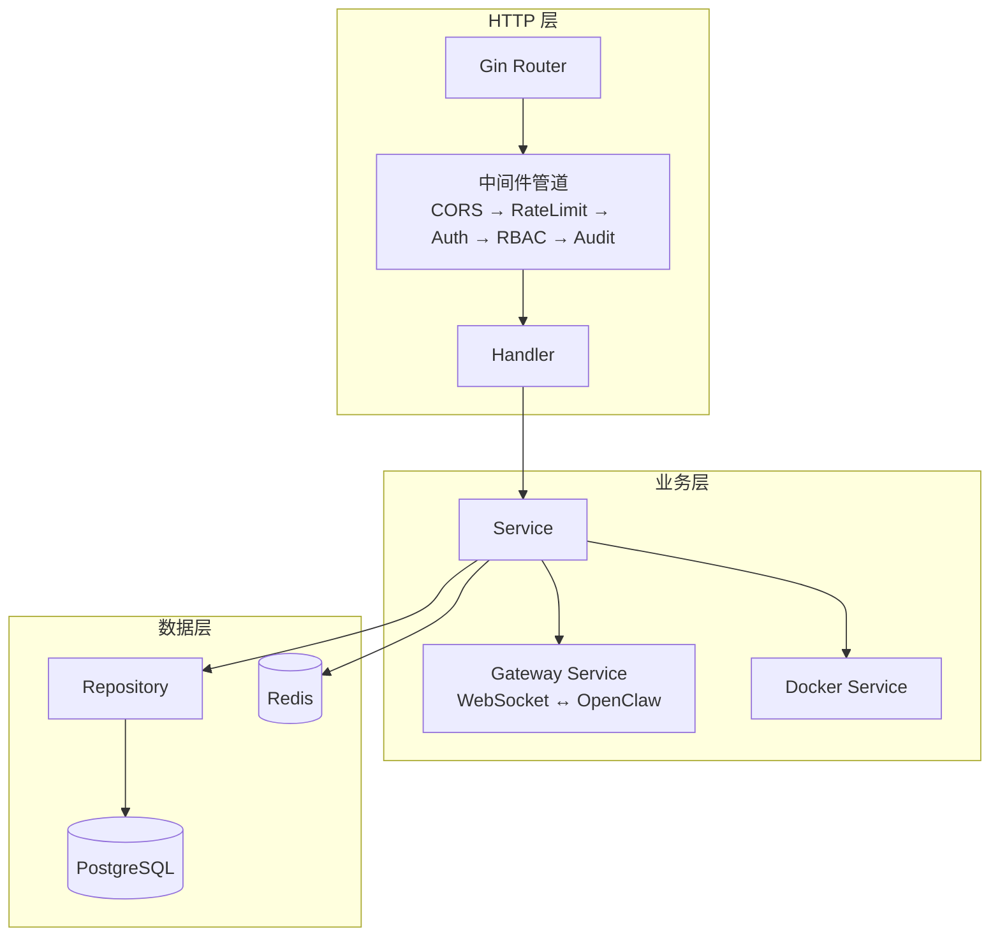
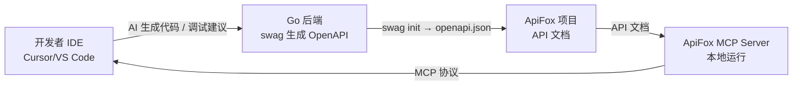
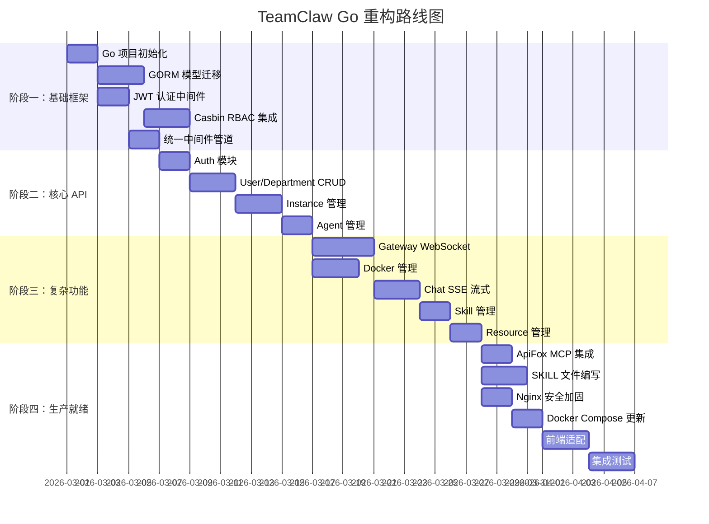

# TeamClaw Go 后端重构实施方案

## 一、高风险漏洞与调试成本的权衡

> [!NOTE]
> 用户提问：当前项目处于 Demo 状态，修复高风险漏洞是否会增加调试成本？

**结论：大部分高风险修复不增加调试成本，个别需做兼容处理。**

| 漏洞 | 修复方式 | 对调试的影响 | 建议 |
|------|---------|-------------|------|
| nginx 安全头丢失 | 在每个 location 块添加 `include` | ⬜ 零影响 | ✅ 立即修复 |
| PostgreSQL 端口暴露 | 删除 `ports: "5432:5432"` | ⚠️ 本地无法直连 DB Studio | 改为 `127.0.0.1:5432:5432` 仅本地访问 |
| Redis 无密码 | 添加 `requirepass` | ⚠️ 需修改 `REDIS_URL` 加密码 | 开发环境可用弱密码 `dev123` |
| CSP 头部缺失 | nginx 添加 CSP 规则 | ⚠️ 过严的 CSP 会阻、`eval` 等调试工具 | 开发环境用宽松 CSP |

**推荐做法**：这些修复留到 Go 重构时在新的 docker-compose 中一并处理，避免修改即将废弃的配置文件。

---

## 二、完整技术栈选型

### 2.1 技术栈对比与最终选型

| 组件 | 当前方案 | 新方案 | 变更理由 |
|------|---------|--------|---------|
| **后端语言** | TypeScript / Next.js API Routes | **Go 1.23+** | 高并发、原生 WS 支持、Casbin RBAC |
| **Web 框架** | Next.js App Router | **Gin** | 成熟、中间件丰富、性能好 |
| **ORM** | Prisma 7 | **GORM** | Go 生态最成熟的 ORM，自带迁移 |
| **数据库** | PostgreSQL 17 | **PostgreSQL 17（不变）** | 已经是最佳选择 |
| **缓存** | Redis 7 (ioredis) | **Redis 7 (go-redis)** | 不变，仅替换客户端库 |
| **认证** | jose (JWT RS256) | **golang-jwt/jwt** | Go 原生 JWT 方案 |
| **权限** | 硬编码 permissions.ts | **Casbin v2** | 动态 RBAC + ABAC |
| **WebSocket** | ws (npm) | **gorilla/websocket** | Go 原生 WS，goroutine 管理 |
| **Docker** | Dockerode | **docker/docker client** | Docker 官方 Go SDK |
| **验证** | Zod | **go-playground/validator** | 结构体 tag 验证 |
| **API 文档** | 无 | **swaggo/swag** | 自动从注释生成 OpenAPI 3.0 |
| **配置管理** | dotenv / process.env | **viper** | 支持多格式、环境变量、热重载 |
| **日志** | console.log | **zap** | 结构化日志，支持日志级别 |
| **前端** | Next.js 16 (React 19) | **Next.js 16（不变）** | 前端保持不动，仅调用后端 API |

### 2.2 PostgreSQL 是否需要更换？

> [!IMPORTANT]
> **不需要更换 PostgreSQL。** 它已经是本项目最佳选择。

理由：
- Casbin 有成熟的 [PostgreSQL adapter](https://github.com/casbin/gorm-adapter)，可将 RBAC 策略存入同一数据库
- GORM + PostgreSQL 支持 JSON/JSONB 字段、全文检索、数组类型，完全覆盖现有 schema 需求
- 审计日志的时序查询在 PostgreSQL 中表现良好，无需引入 ClickHouse 等 OLAP 数据库（Demo 阶段）
- 唯一需要考虑的是**未来**是否引入 MongoDB 存储非结构化的 Agent 配置，但现阶段 JSONB 字段足够

---

## 三、Go 后端项目结构设计

```
teamclaw-server/              # 新建 Go 后端仓库（或 monorepo 子目录）
├── cmd/
│   └── server/
│       └── main.go            # 入口点
├── internal/
│   ├── config/                # Viper 配置加载
│   ├── middleware/             # Gin 中间件
│   │   ├── auth.go            # JWT 认证
│   │   ├── rbac.go            # Casbin RBAC 鉴权
│   │   ├── ratelimit.go       # 速率限制
│   │   ├── audit.go           # 审计日志中间件
│   │   └── cors.go            # CORS 配置
│   ├── handler/               # HTTP 处理器（按模块分组）
│   │   ├── auth.go            # 登录/注册/刷新
│   │   ├── user.go            # 用户管理 CRUD
│   │   ├── department.go      # 部门管理
│   │   ├── instance.go        # OpenClaw 实例管理
│   │   ├── agent.go           # Agent 元数据管理
│   │   ├── chat.go            # 聊天（SSE 流式）
│   │   ├── skill.go           # 技能管理
│   │   ├── resource.go        # 资源（模型 Key）管理
│   │   ├── audit_log.go       # 审计日志查询/导出
│   │   ├── dashboard.go       # 仪表板统计
│   │   └── rbac.go            # 角色/权限管理（新增）
│   ├── model/                 # GORM 模型定义
│   │   ├── user.go
│   │   ├── department.go
│   │   ├── instance.go
│   │   ├── agent.go
│   │   ├── skill.go
│   │   ├── resource.go
│   │   ├── chat.go
│   │   ├── audit.go
│   │   └── rbac.go            # 角色/权限模型
│   ├── service/               # 业务逻辑层
│   │   ├── auth.go
│   │   ├── user.go
│   │   ├── instance.go
│   │   ├── gateway/           # OpenClaw 网关通信
│   │   │   ├── client.go      # WebSocket 客户端
│   │   │   ├── adapter.go     # 协议适配器
│   │   │   ├── registry.go    # 连接注册表
│   │   │   └── health.go      # 健康检查 goroutine
│   │   ├── docker/            # Docker 管理
│   │   │   ├── manager.go
│   │   │   └── config.go
│   │   └── rbac.go            # RBAC 服务
│   ├── repository/            # 数据访问层
│   │   ├── user.go
│   │   ├── instance.go
│   │   └── ...
│   └── pkg/                   # 通用工具包
│       ├── crypto/            # 加密/解密
│       ├── response/          # 统一响应格式
│       └── validator/         # 自定义验证器
├── migrations/                # 数据库迁移
├── api/                       # OpenAPI 3.0 spec（swag 生成）
├── configs/                   # 配置文件模板
├── docker/
│   ├── Dockerfile
│   ├── docker-compose.yml
│   ├── docker-compose.prod.yml
│   └── nginx/
├── docs/                      # 项目文档
├── go.mod
└── go.sum
```

### 3.1 分层架构



### 3.2 Casbin RBAC 策略模型

使用 **RBAC with domains**（域 = 部门），支持多租户权限隔离：

```ini
# model.conf
[request_definition]
r = sub, dom, obj, act

[policy_definition]
p = sub, dom, obj, act

[role_definition]
g = _, _, _

[policy_effect]
e = some(where (p.eft == allow))

[matchers]
m = g(r.sub, p.sub, r.dom) && r.dom == p.dom && r.obj == p.obj && r.act == p.act \
    || g(r.sub, p.sub, "*") && p.dom == "*" && r.obj == p.obj && r.act == p.act
```

```csv
# 策略示例
p, system_admin, *, users, create        # 系统管理员在任何域都能创建用户
p, system_admin, *, users, delete
p, dept_admin, dept_a, users, list       # 部门A管理员只能查看本部门用户
p, operator, *, agents, view             # 操作员可查看所有 Agent
p, auditor, *, audit, view_all           # 审计员可查看所有审计日志

g, alice, system_admin, *               # alice 是全局系统管理员
g, bob, dept_admin, dept_a              # bob 是部门A的管理员
g, charlie, operator, dept_b            # charlie 是部门B的操作员
```

---

## 四、API 端点完整映射

从现有 27 个 API route 映射到 Go handler：

| 现有 API | Go Handler | 权限标识 |
|----------|-----------|---------|
| `POST /api/v1/auth/login` | `handler.Login` | public |
| `POST /api/v1/auth/register` | `handler.Register` | public |
| `POST /api/v1/auth/refresh` | `handler.RefreshToken` | public |
| `POST /api/v1/auth/logout` | `handler.Logout` | authenticated |
| `GET /api/v1/auth/me` | `handler.GetMe` | authenticated |
| `GET /api/v1/users` | `handler.ListUsers` | `users:list` |
| `POST /api/v1/users` | `handler.CreateUser` | `users:create` |
| `PATCH /api/v1/users/:id` | `handler.UpdateUser` | `users:update` |
| `DELETE /api/v1/users/:id` | `handler.DeleteUser` | `users:delete` |
| `GET /api/v1/departments` | `handler.ListDepartments` | `departments:view` |
| `POST /api/v1/departments` | `handler.CreateDepartment` | `departments:manage` |
| `PATCH /api/v1/departments/:id` | `handler.UpdateDepartment` | `departments:manage` |
| `DELETE /api/v1/departments/:id` | `handler.DeleteDepartment` | `departments:manage` |
| `GET /api/v1/instances` | `handler.ListInstances` | `instances:view` |
| `POST /api/v1/instances` | `handler.CreateInstance` | `instances:manage` |
| `GET /api/v1/instances/:id` | `handler.GetInstance` | `instances:view` |
| `PATCH /api/v1/instances/:id` | `handler.UpdateInstance` | `instances:manage` |
| `DELETE /api/v1/instances/:id` | `handler.DeleteInstance` | `instances:manage` |
| `GET /api/v1/agents` | `handler.ListAgents` | `agents:view` |
| `POST /api/v1/agents` | `handler.CreateAgent` | `agents:create` |
| `PATCH /api/v1/agents/:id` | `handler.UpdateAgent` | `agents:manage` |
| `POST /api/v1/agents/clone` | `handler.CloneAgent` | `agents:create` |
| `POST /api/v1/chat/send` | `handler.ChatSend` (SSE) | `chat:use` |
| `GET /api/v1/chat/sessions` | `handler.ListSessions` | `sessions:view_own` |
| `GET /api/v1/chat/agents` | `handler.ListChatAgents` | `chat:use` |
| `GET /api/v1/skills` | `handler.ListSkills` | `skills:develop` |
| `POST /api/v1/skills` | `handler.CreateSkill` | `skills:develop` |
| `GET /api/v1/resources` | `handler.ListResources` | `resources:manage` |
| `POST /api/v1/resources` | `handler.CreateResource` | `resources:manage` |
| `GET /api/v1/audit-logs` | `handler.ListAuditLogs` | `audit:view_all` |
| `GET /api/v1/audit-logs/export` | `handler.ExportAuditLogs` | `audit:view_all` |
| `GET /api/v1/dashboard` | `handler.GetDashboard` | authenticated |
| **🆕 `GET /api/v1/rbac/roles`** | `handler.ListRoles` | `rbac:manage` |
| **🆕 `POST /api/v1/rbac/roles`** | `handler.CreateRole` | `rbac:manage` |
| **🆕 `PUT /api/v1/rbac/roles/:id/permissions`** | `handler.SetRolePermissions` | `rbac:manage` |
| **🆕 `POST /api/v1/rbac/users/:id/roles`** | `handler.AssignUserRole` | `rbac:manage` |

---

## 五、SKILL 工作流设计

> [!TIP]
> 每个后端模块对应一个 SKILL 文件，AI 调试时可根据上下文自动加载对应模块的开发规范。

### 5.1 SKILL 文件规划

在项目根目录创建 `.agents/skills/` 结构：

```
.agents/
├── skills/
│   ├── go-api-development/
│   │   └── SKILL.md           # Go API 通用开发规范
│   ├── auth-jwt/
│   │   └── SKILL.md           # JWT 认证模块开发指南
│   ├── rbac-casbin/
│   │   └── SKILL.md           # Casbin RBAC 配置与策略编写
│   ├── gateway-websocket/
│   │   └── SKILL.md           # OpenClaw Gateway WebSocket 协议
│   ├── docker-management/
│   │   └── SKILL.md           # Docker 容器管理接口
│   ├── database-migration/
│   │   └── SKILL.md           # GORM 迁移与数据库操作
│   ├── sse-streaming/
│   │   └── SKILL.md           # SSE 流式响应实现
│   └── testing/
│       └── SKILL.md           # Go 后端测试策略
└── workflows/
    ├── new-api-endpoint.md    # 新增 API 端点工作流
    ├── add-rbac-permission.md # 新增权限项工作流
    ├── debug-gateway.md       # 调试 Gateway 连接工作流
    └── run-tests.md           # 运行测试工作流
```

### 5.2 核心 SKILL 内容概要

#### `go-api-development/SKILL.md`
```yaml
---
description: Go API 通用开发规范 - 端到端创建 RESTful API 端点
---
```
- Handler → Service → Repository 三层架构规范
- 统一响应格式 `{ code, message, data }`
- 错误处理规范（业务错误码 vs HTTP 状态码）
- 参数校验 tag 使用规范（binding:"required"）
- Swagger 注释格式

#### `rbac-casbin/SKILL.md`
```yaml
---
description: Casbin RBAC 策略管理 - 角色、权限、域的配置与调试
---
```
- Casbin model.conf 语法说明
- 策略 CRUD 的 API 调用方式
- 调试策略匹配问题的工具命令
- 常见策略配置模式（角色继承、域隔离）

#### `gateway-websocket/SKILL.md`
```yaml
---
description: OpenClaw Gateway WebSocket 协议 - 连接、请求、事件处理
---
```
- Gateway V1 协议的请求/响应格式
- 方法清单：`agents.list`, `sessions.list`, `chat.send`, `config.get` 等
- 连接握手流程（challenge → connect → hello-ok）
- 心跳/断线重连逻辑

---

## 六、ApiFox MCP 集成方案

### 6.1 集成架构



### 6.2 工作流程

1. **Go 后端用 swag 注释生成 OpenAPI 3.0 spec**
   ```go
   // @Summary 获取用户列表
   // @Tags users
   // @Security BearerAuth
   // @Param page query int false "页码" default(1)
   // @Success 200 {object} response.ListResponse[model.UserResponse]
   // @Router /api/v1/users [get]
   func (h *UserHandler) List(c *gin.Context) { ... }
   ```

2. **将 OpenAPI spec 导入 ApiFox 项目**（支持自动同步）

3. **配置 ApiFox MCP Server**
   ```json
   // .cursor/mcp.json 或 IDE 全局配置
   {
     "mcpServers": {
       "apifox": {
         "command": "npx",
         "args": ["-y", "apifox-mcp-server@latest"],
         "env": {
           "APIFOX_ACCESS_TOKEN": "<your-token>",
           "APIFOX_PROJECT_ID": "<teamclaw-project-id>"
         }
       }
     }
   }
   ```

4. **AI 调试场景**
   - "根据 ApiFox 文档，生成创建实例接口的单元测试"
   - "这个接口返回 422，帮我对照 ApiFox 文档检查请求体是否合规"
   - "根据 ApiFox 中的接口定义，生成前端 TypeScript SDK"

---

## 七、额外开发优化建议

### 7.1 开发体验优化

| 优化 | 方案 | 收益 |
|------|------|------|
| **热重载** | [air](https://github.com/air-verse/air) | Go 代码修改后自动重编译重启 |
| **Makefile 统一入口** | `make dev`, `make test`, `make migrate`, `make swagger` | 统一命令，降低上手门槛 |
| **Git Hooks** | golangci-lint + pre-commit | 提交前自动 lint |
| **CI/CD** | GitHub Actions | 自动测试 → 构建 → 部署 |

### 7.2 可观测性

| 组件 | 方案 | 理由 |
|------|------|------|
| **结构化日志** | zap / zerolog | 替代 console.log，支持 JSON 输出 |
| **链路追踪** | OpenTelemetry → Jaeger | 全链路追踪请求（HTTP → Gateway WS → Docker exec） |
| **指标采集** | Prometheus + Grafana | 监控 API QPS、延迟、错误率、WS 连接数 |
| **健康检查端点** | `GET /healthz`, `GET /readyz` | K8s 原生支持 |

### 7.3 安全加固

| 措施 | 说明 |
|------|------|
| **Docker Socket 隔离** | Go 后端通过独立的 **Docker Proxy 微服务** 间接操作容器，限制可执行操作 |
| **密钥管理** | 使用 Vault 或 SOPS 管理 JWT 密钥和加密密钥，避免明文存储在 .env |
| **API 限流** | Gin 中间件 + Redis 滑动窗口限流，防暴力登录和 DDoS |
| **请求签名** | 前端调用后端 API 增加 HMAC 签名，防止 API 被直接调用 |

### 7.4 数据库优化

| 措施 | 说明 |
|------|------|
| **连接池管理** | GORM 配置 `MaxOpenConns` / `MaxIdleConns` / `ConnMaxLifetime` |
| **读写分离** | 如未来流量增长，PostgreSQL 添加 read replica |
| **审计日志分区** | 按月分区 `audit_logs` 表，避免单表过大 |
| **软删除** | 用户/部门/实例等实体使用 `deleted_at` 软删除 |

### 7.5 前端适配

由于后端从 Next.js 分离，前端需要做的调整：

| 变更 | 说明 |
|------|------|
| **API 基地址** | 环境变量 `NEXT_PUBLIC_API_URL` 指向 Go 后端 |
| **认证流程** | Cookie → Bearer Token（Authorization header） |
| **SSE 连接** | 前端直连 Go 后端的 SSE 端点 |
| **Next.js 中间件** | 仅保留前端路由守卫，不再做 JWT 验证 |
| **构建部署** | 前端独立构建和部署，通过 nginx 代理到前后端 |

---

## 八、重构路线图



---

## 九、验证计划

### 自动化测试
- 每个 handler 编写 table-driven 单元测试（Go 标准 `testing` + `httptest`）
- 使用 `testcontainers-go` 运行集成测试（真实 PostgreSQL + Redis 容器）
- 命令：`go test ./...` / `make test`

### ApiFox 验证
- 将 swag 生成的 OpenAPI spec 导入 ApiFox
- 在 ApiFox 中针对每个 API 创建测试用例
- 通过 ApiFox 的自动化测试功能批量运行

### 手动验证
- 前后端联调：Next.js 前端 → Go 后端 → OpenClaw 实例完整流程
- RBAC 功能：通过管理界面创建自定义角色、分配权限、验证权限生效
- 安全审计：使用 `nmap` / `nikto` 扫描新的 nginx 配置
